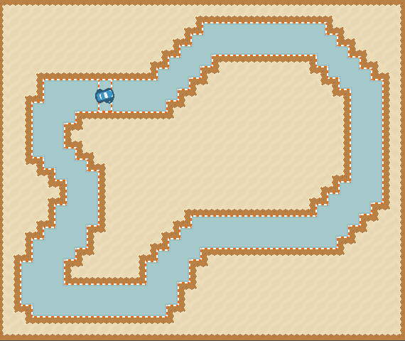

# Self Driving
Exploring ways to create AIs capable of completing as many laps as possible.

## Supported methods:
- [ ] Classical control
- [x] Genetic algorithms
    * NEAT algorithm
- [ ] Behavioural cloning
- [ ] Reinforcement learning

## Code sources
* Genetic algorithms - https://github.com/CodeReclaimers/neat-python
* CI/CD pipelines - https://github.com/abarichello/godot-ci