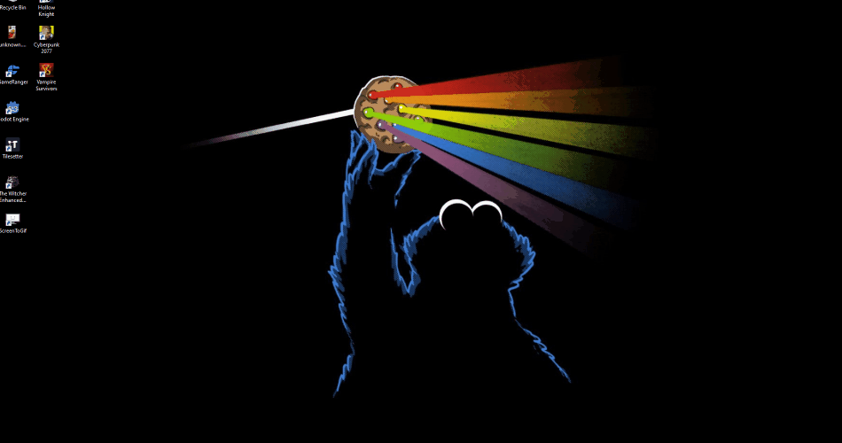

# How to use

## 1. Open Godot project and start main scene


## 2. Install requirements
1.1. Create python environment
```
python -m venv .env
```
1.2. Install dependencies
```
# Ubuntu
source .env/bin/activate
pip install -r requirements.txt

# Windows
.env/Scripts/activate
pip install -r requirements.txt
```
1.3. (Optional) Install Graphviz \
See link: https://graphviz.org/download/

## 3. Start Python script 
Run in the same python environment as above
```
python main.py
```